# Assignment 1 – Building & Deploying the Application

## Application Development
This project is a full-stack ToDo List web application composed of:
- **Frontend:**
  - Built using React
  - Implements task creation, deletion, and update
  
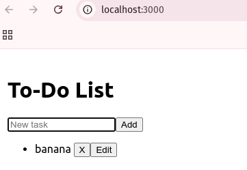
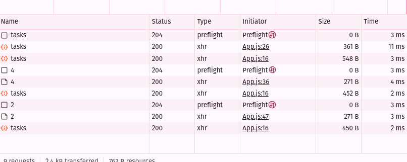

  - Axios used for API calls
- **Backend:**
  - Express server with routes for `/tasks` (GET, POST, PUT, DELETE)
  - Connects to PostgreSQL using `pg` library

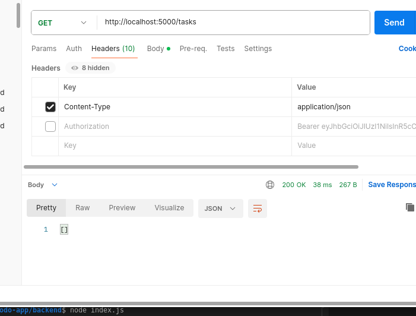

- **Database:**
  - Tasks stored with fields: `id`, `description`, `is_complete`, `created_at`

## Environment Variables
- Frontend:
  ```env
  REACT_APP_API_URL=http://localhost:5000

- Backend:
  ```env
  PORT=5000
  DB_HOST=localhost
  DB_USER=postgres
  DB_PASSWORD=password
  DB_NAME=todolist
  ```
## Dockerization

- Backend `Dockerfile`
```dockerfile
FROM node:18-alpine
WORKDIR /app
COPY package*.json ./
RUN npm install
COPY . .
EXPOSE 5000
CMD ["node", "index.js"]
```

- Frontend `Dockerfile`
```dockerfile
FROM node:18-alpine AS build
WORKDIR /app
COPY package*.json ./
RUN npm install
COPY . .
RUN npm run build

FROM nginx:alpine
COPY --from=build /app/build /usr/share/nginx/html
EXPOSE 80
CMD ["nginx", "-g", "daemon off;"]
```

## Pushing Images to Docker Hub

```bash
# Backend
docker build -t pomegranatei/be-todo:02230295 ./backend
docker push pomegranatei/be-todo:02230295

# Frontend
docker build -t pomegranatei/fe-todo:02230295 ./frontend
docker push pomegranatei/fe-todo:02230295
```
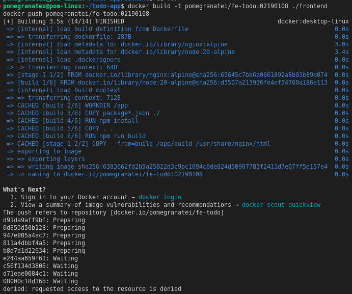
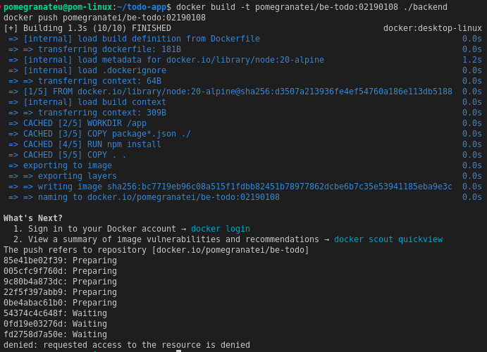

## Deploying on Render.com

* **Backend Image**: [pomegranatei/fe-todo:02230295](https://be-todo-02230295.onrender.com)

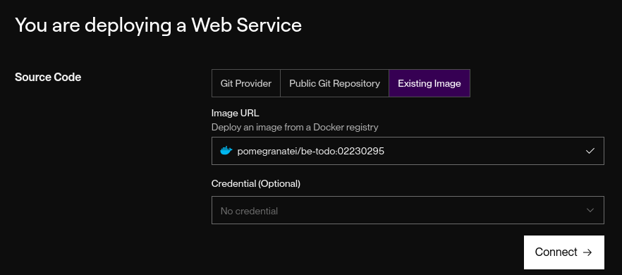
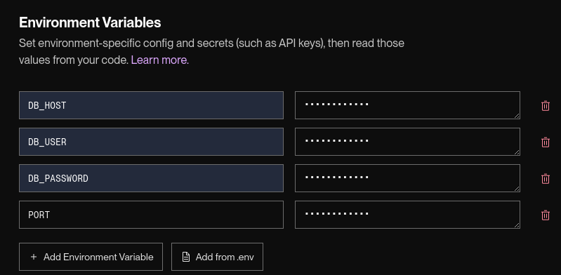
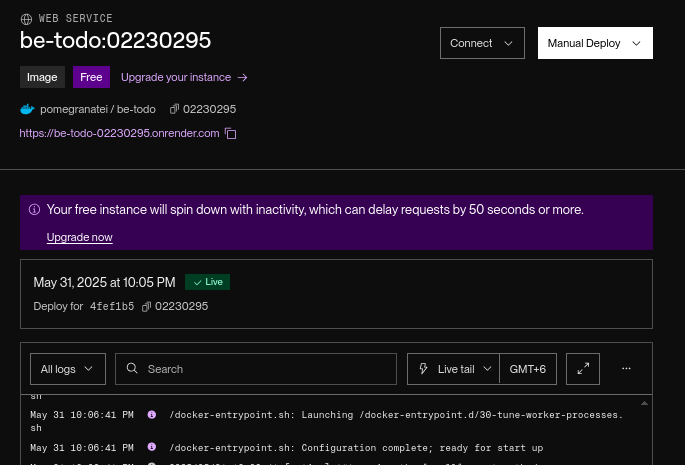

* **Frontend Image**: [pomegranatei/fe-todo:02230295](https://fe-todo-02230295.onrender.com)

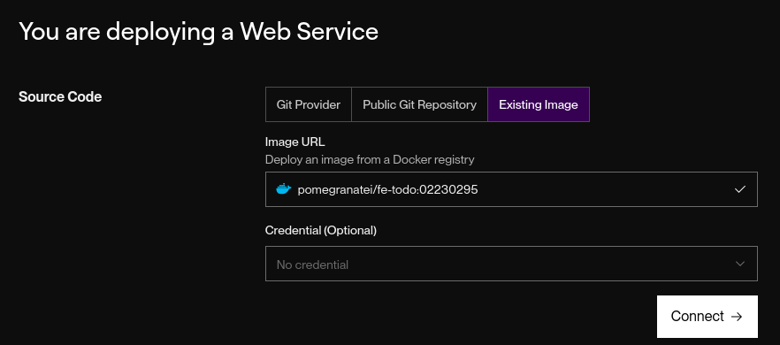
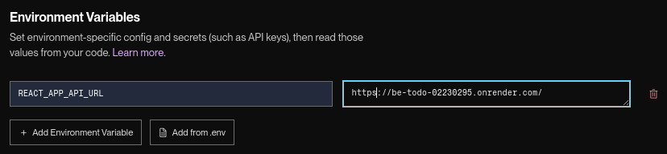
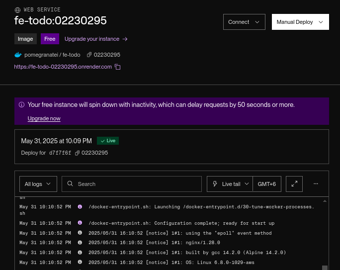

## Challenges & Solutions

- CORS Errors in React Frontend
   - **Problem**: While testing the frontend locally, Axios requests to the backend threw CORS errors.
   - **Cause**: The backend did not have proper CORS configuration.
   - **Solution**: Installed and configured the cors package in backend/index.js

- Task Operations Not Working in Docker
   - **Problem**: Edit and add task features worked when running locally (node index.js) but failed when using the Docker image.
   - **Cause**: Docker image was outdated or used incorrect .env settings.
   - **Solution**: Rebuilt Docker images after fixing code and .env variables:

- Render Backend Not Connecting to Database
   - **Problem**: Render backend failed to start due to DB connection errors.
   - **Cause**: Missing or incorrect `DB_HOST`, `DB_USER`, and `DB_PASSWORD`.
   - **Solution**: Retrieved correct credentials from Render's PostgreSQL dashboard and added them to `.env.production` and Render's environment tab.

# Assignment 2 – CI/CD Pipeline for ToDo App

## Project Overview

This project is a full-stack ToDo List web application composed of:
- **Frontend:** React
- **Backend:** Node.js + Express
- **Database:** PostgreSQL
- **CI/CD:** Jenkins Pipeline
- **Containerization:** Docker + DockerHub

## Jenkins Pipeline Stages

### Jenkinsfile (Declarative Pipeline)
The pipeline consists of the following stages:

1. **Checkout**
   - Clones GitHub repository

2. **Install Backend**
   - Runs `npm install` in `backend/`

3. **Test Backend**
   - Runs `npm test` using Jest
   - Publishes results using JUnit

4. **Install Frontend**
   - Runs `npm install` in `frontend/`

5. **Build Frontend**
   - Runs `npm run build` to generate production bundle

6. **Docker Build & Push Backend**
   - Builds Docker image from `backend/Dockerfile`
   - Pushes to DockerHub as `pomegranatei/todolist-backend:latest`

7. **Docker Build & Push Frontend**
   - Builds Docker image from `frontend/Dockerfile`
   - Pushes to DockerHub as `pomegranatei/todolist-frontend:latest`


## DockerHub Repositories

- Backend: [docker.io/pomegranatei/todolist-backend](https://hub.docker.com/r/pomegranatei/todolist-backend)
- Frontend: [docker.io/pomegranatei/todolist-frontend](https://hub.docker.com/r/pomegranatei/todolist-frontend)

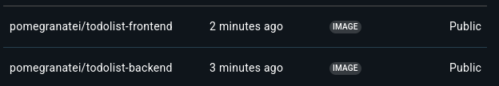

## Deployment

- Creating credentials in Jenkins for GitHub

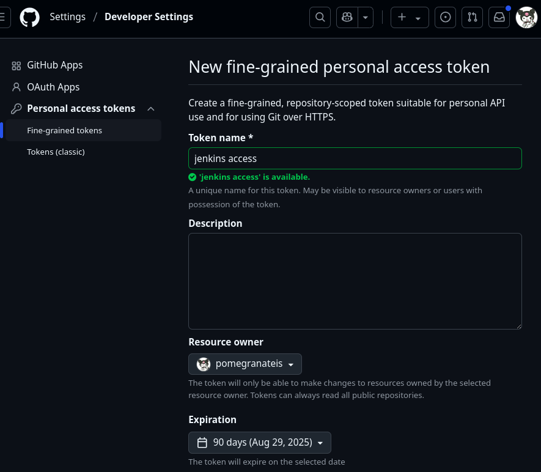
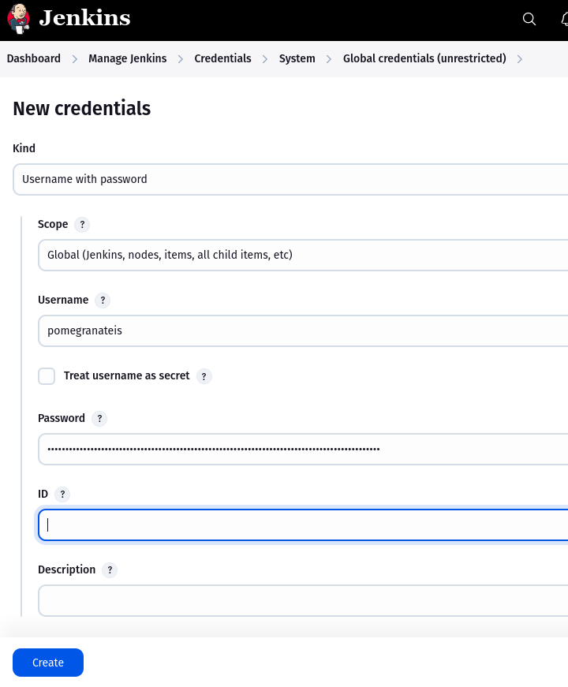

## Testing

- Jest used for backend unit testing
- Example test in `backend/test/basic.test.js`
- Results published in Jenkins via JUnit plugin

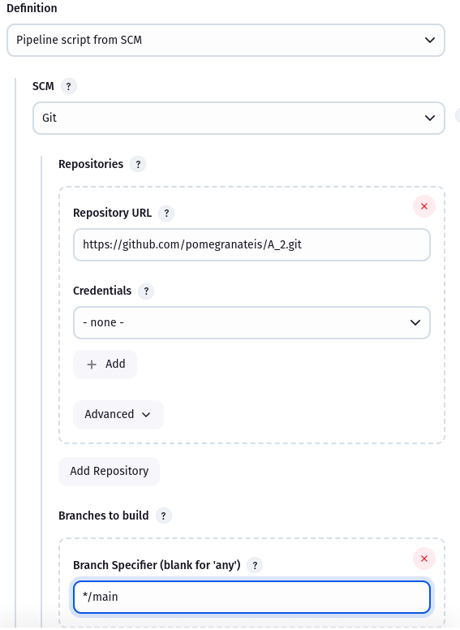

## Challenges & Solutions

- Jenkins "No such DSL method 'steps'" Error
   - **Problem**: Pipeline failed with `No such DSL method 'steps'` error.
   - **Cause**: Incorrect use of `steps` block inside a Scripted Pipeline context.
   - **Solution**: Rewrote the `Jenkinsfile` using proper Declarative syntax with `pipeline { agent any ... }.`

- Outdated Code in Docker Build
   - **Problem**: Jenkins built and pushed old code version.
   - **Cause**: Local edits not committed before pushing.
   - **Solution**: Always commit + push before triggering Jenkins

## Conclusion

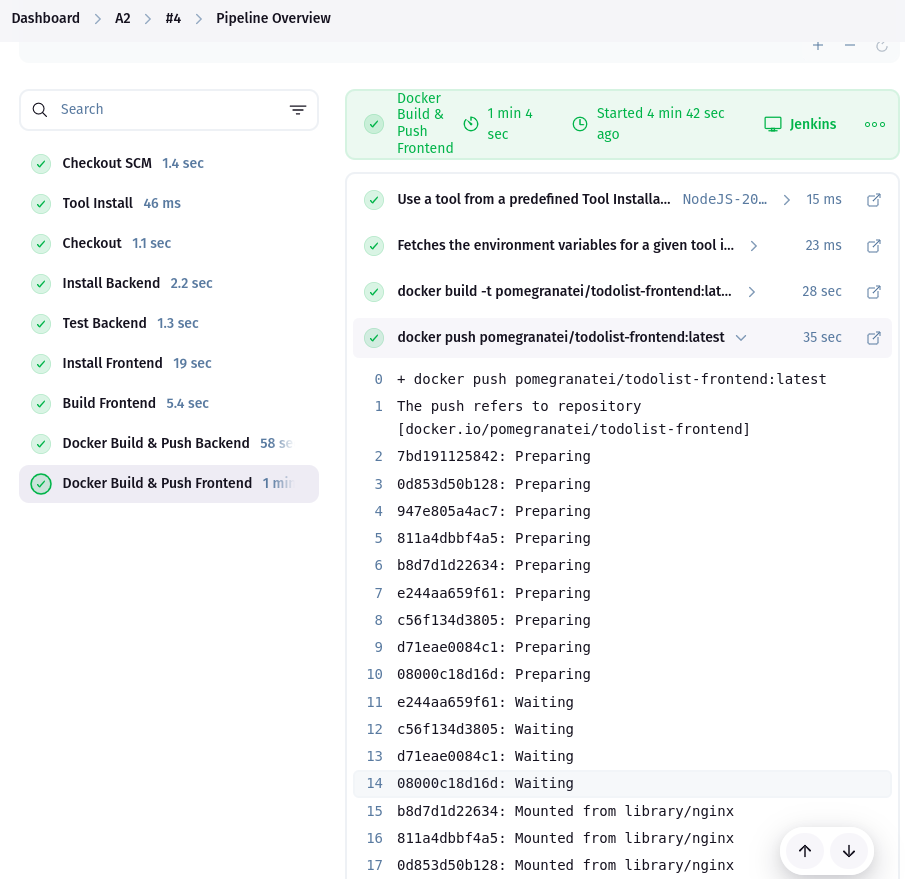

This pipeline demonstrates a complete CI/CD flow using Jenkins, Docker, and GitHub. All major development lifecycle stages — build, test, and deploy — are automated for both frontend and backend.

# Assignment 3: GitHub Actions CI/CD Workflow

## Objective

The goal of Assignment 3 was to configure a `GitHub Actions workflow` to:
1. **Build** a Docker container for the ToDo app.
2. **Push** the image to DockerHub.
3. **Deploy** the image on Render.com.

This was accomplished by automating the workflow with GitHub Actions, DockerHub credentials, and an optional webhook from Render.

## Tasks Completed

### Task 1: Repository Setup
Verified that `package.json` in the backend contained proper scripts:

```json
{
  "start": "node index.js",
  "test": "jest"
}
```
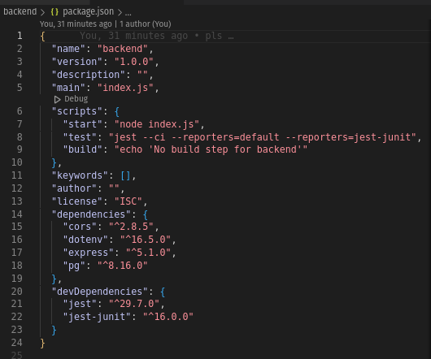

- Confirmed that the GitHub repo was set to public.

### Task 2: Dockerfile Configuration
Verified a production-ready Dockerfile in `backend/`:

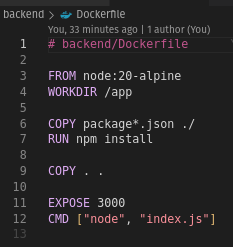

- Built and tested the image locally with:

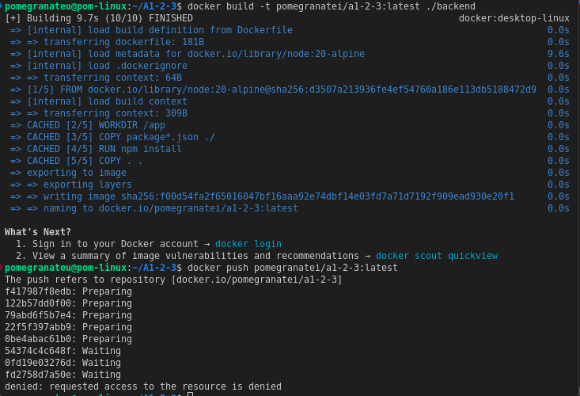

### Task 3: GitHub Actions Workflow
Created .github/workflows/deploy.yml with the following structure:

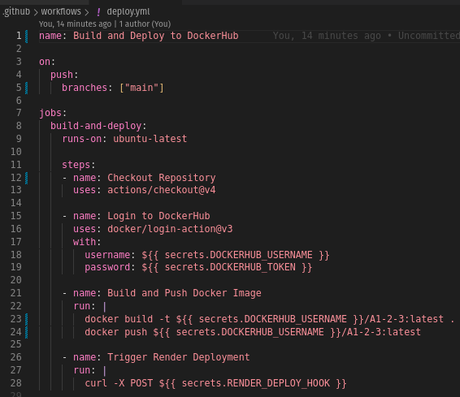

- Stored DockerHub credentials and webhook in repository **Secrets**:
   - `DOCKERHUB_USERNAME`
   - `DOCKERHUB_TOKEN`

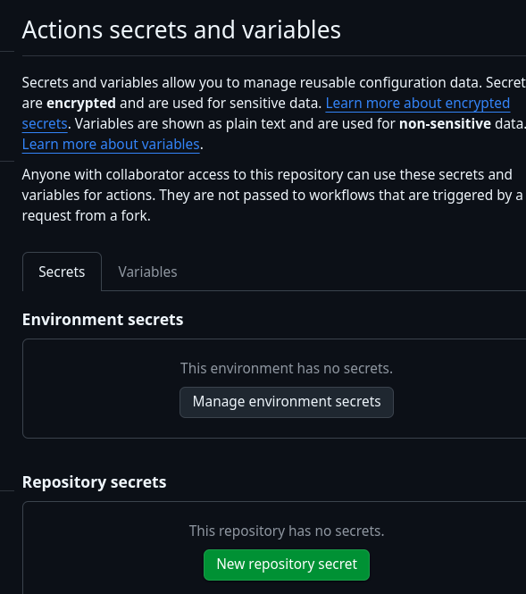
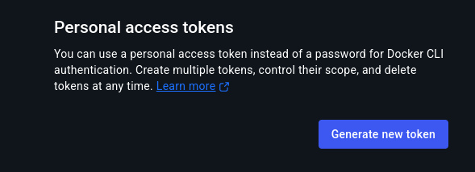
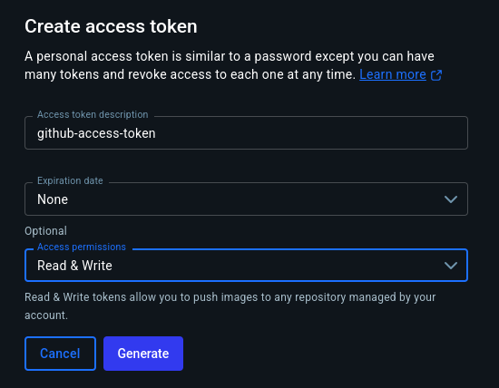
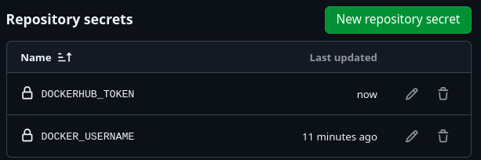

**Successful Log**
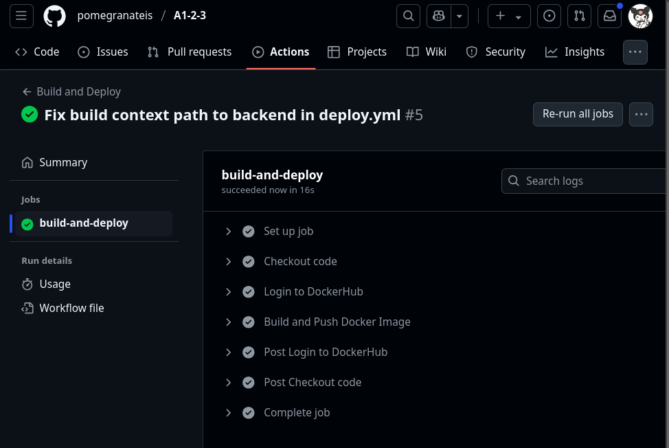
### Task 4: Deployment on Render

- First push the image to DockerHub properly by logging in.
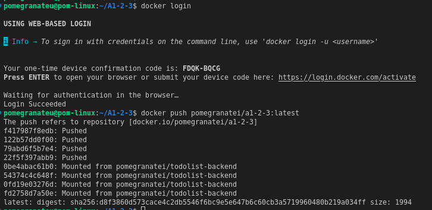
- Created a backend service on Render
- Selected "Deploy from DockerHub image"
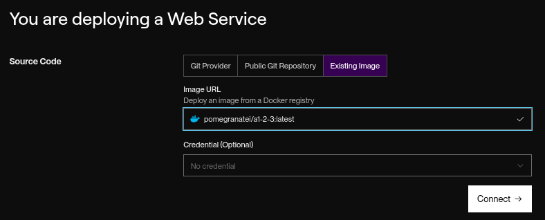
- Used image: pomegranatei/a1-2-3:latest
- Set environment variables:
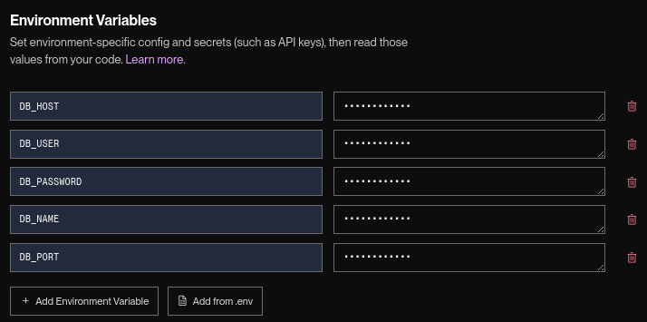
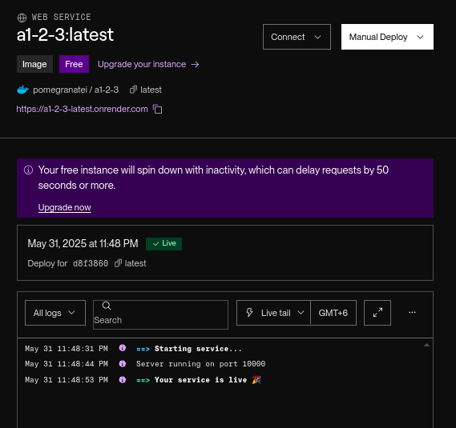

## Challenges & Solutions

- GitHub Actions syntax failed in terminal
   - **Problem**: Tried to use `${{ secrets.VAR }}` in Bash and got “bad substitution”.
   - **Solution**: Replaced with direct values in local CLI. `${{ secrets.* }}` only works inside GitHub Actions.

- DockerHub rejected uppercase repo name
   - **Problem**: `docker build` failed with “repository name must be lowercase”.
   - **Solution**: Renamed `A1-2-3` → `a1-2-3` to follow Docker’s lowercase-only convention.

- Forgot to set secrets in GitHub
   - **Problem**: GitHub Actions failed to log in to DockerHub.
   - **Solution**: Set `DOCKERHUB_USERNAME` and `DOCKERHUB_TOKEN` in GitHub.

## Conclusion
In this assignment, I successfully implemented a full CI/CD pipeline using GitHub Actions, DockerHub, and Render.com to automate the deployment of my ToDo application backend. The process involved containerizing the backend codebase, pushing the image to DockerHub, and configuring GitHub Actions to streamline the workflow with every commit to the main branch.

By integrating secrets securely within GitHub, I ensured that the DockerHub credentials and Render deployment webhook were handled safely. This automated workflow significantly reduces manual deployment effort and ensures consistency across deployments.

Throughout this assignment, I deepened my understanding of:
- Docker image creation and tagging
- Secure credential management in GitHub
- Automated build pipelines using GitHub Actions
- Third-party cloud deployment using pre-built container images

The deployment on Render was verified to be live and functional, serving as a robust proof-of-concept for modern DevOps practices in real-world web applications.

