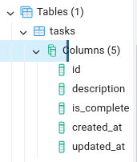
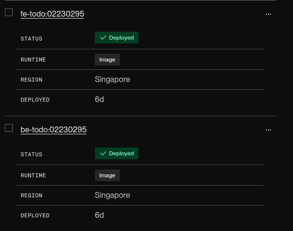
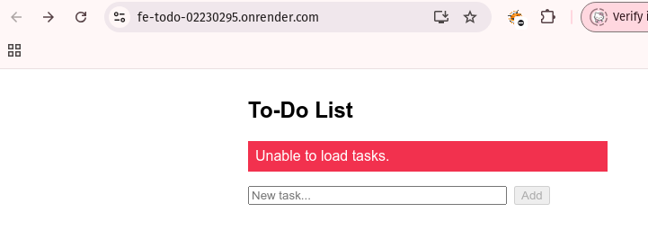
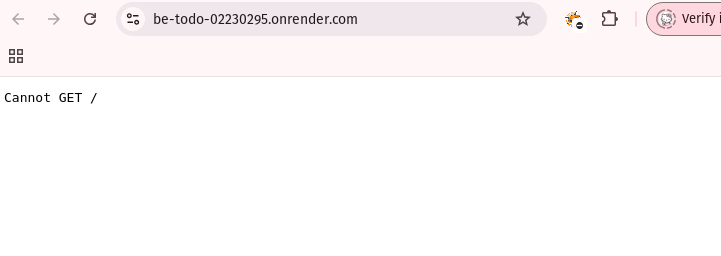

# To-Do List Web Application

A simple full-stack To-Do List app with:

- **Frontend**: React  
- **Backend**: Node.js + Express  
- **Database**: PostgreSQL  
- **Deployment**: Docker for containerization  

## Features
- **CRUD** on tasks: Create, Read, Update (edit & toggle complete), Delete  
- **Optimistic UI**: instant feedback, rollback on error  
- **Loading & Error States**: disable buttons & show messages during network calls  
- **Environment-driven**: `.env` files for configuration  
- **Docker**: build & push images for both services  
- **Deployment**: pushing to Docker Hub + Render.com

## Prerequisites

- **Node.js** v14+ & **npm**  
- **PostgreSQL** v12+ (or Dockerized Postgres)  
- **Docker** & **Docker Hub** account (for container builds)  
- **Render.com** account

## Environment Variables

### Backend (`backend/.env`)

```dotenv
DB_HOST=localhost
DB_USER=postgres
DB_PASSWORD=YourPostgresPassword
DB_NAME=todo_app
DB_PORT=5432
PORT=5000
```
### Frontend (`frontend/.env`)

```bash
REACT_APP_API_URL=http://localhost:5000
```

***Note***: For production, replace with the deployed backend URL (e.g. in my case https://be-todo.onrender.com).

## Local Development

**1. Database Setup**
- ensure PostgreSQL is running locally.

- create the database and table



**2. Backend**

**3. Frontend**

**4. Docker**
- For both Frontend/Backend Image

We need to run:
```bash
docker build
docker docker push 
```

## Deployment (Render.com — In Progress)

Currently, backend and frontend deployment is still pending.

For API Endpoints, Request/Response bodies are JSON.

## Render Deployment



### Frontend



### Backend



- **error** messages pop up due to frontend-backend connection issues.