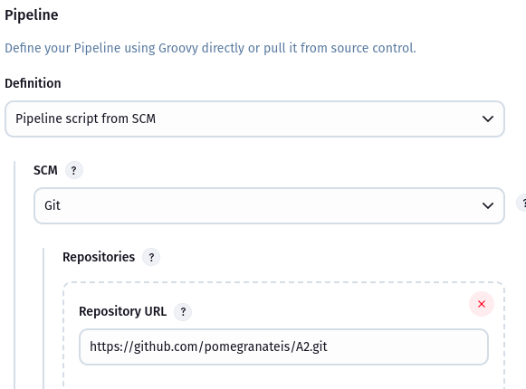
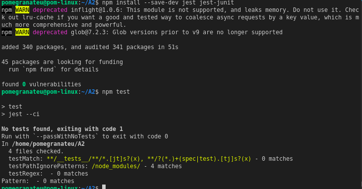
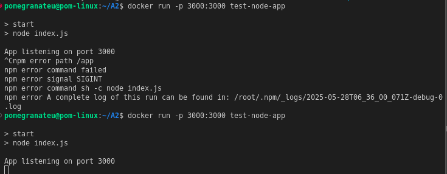
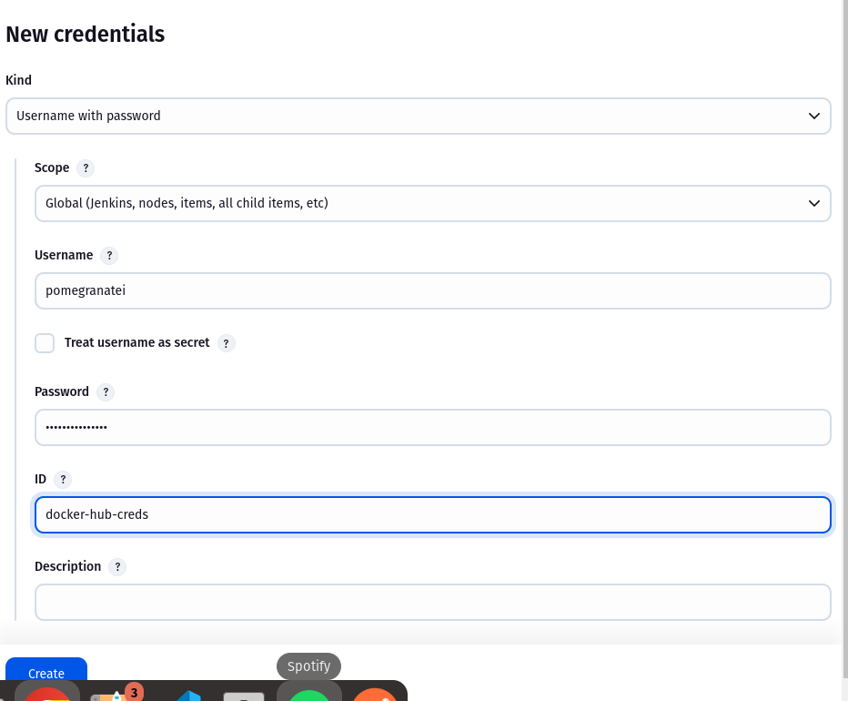
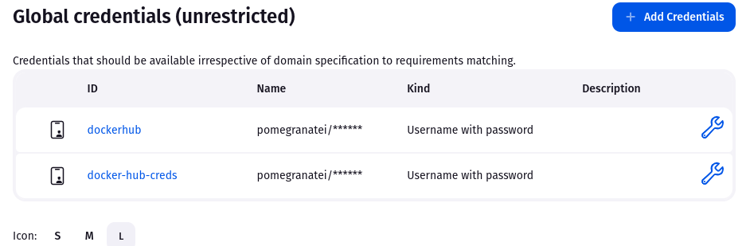
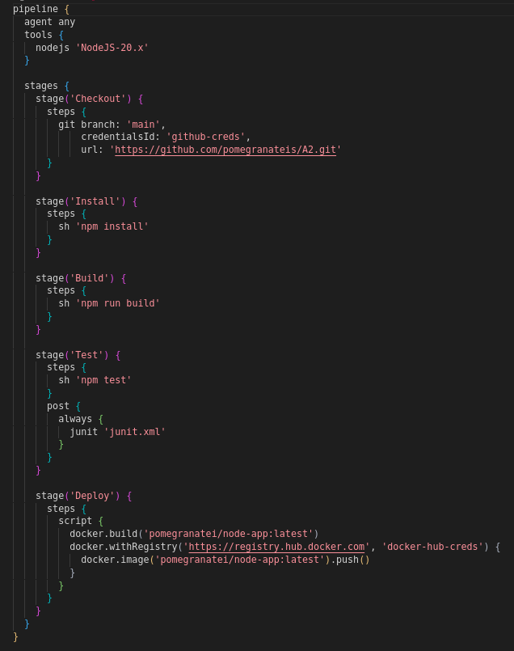
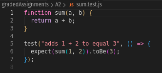
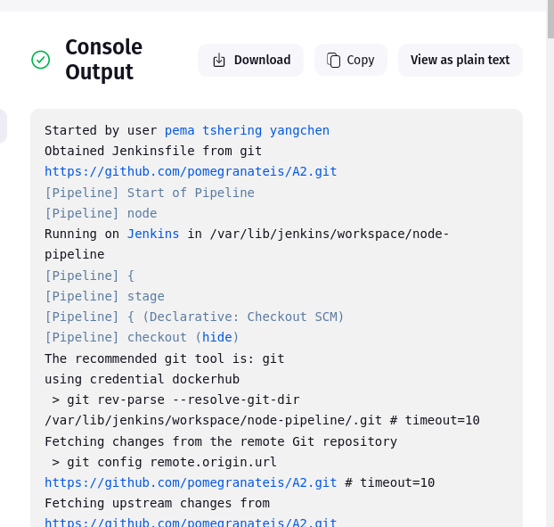
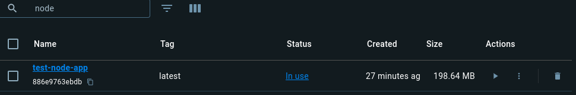

# Jenkins CI/CD Pipeline Report – Node.js Project (A2)

## Objective

The goal of this project was to configure a **Jenkins CI/CD pipeline** to automate the following for a Node.js application:

- Checkout source code from GitHub
- Install dependencies using `npm install`
- Run a build step
- Execute unit tests with Jest
- Push a Docker image to Docker Hub for deployment









## Pipeline Breakdown (Jenkinsfile)



## Test Setup

- Unit test written in `sum.test.js`:



- Test results are written to `junit.xml` using `jest-junit` reporter.

## Dockerfile

```Dockerfile
FROM node:20-alpine
WORKDIR /app
COPY package*.json ./
RUN npm install
COPY . .
CMD ["npm", "start"]
```


## Achievements

- Code successfully checked out via GitHub credentials.
- npm dependencies installed correctly.
- Tests executed and published via Jenkins.
- Docker image built and pushed to Docker Hub.
- All pipeline stages completed successfully.



## Deliverables

- Jenkinsfile with complete pipeline stages
- Screenshots of Jenkins UI and Console Output
- Docker Hub image: `pomegranatei/node-app:latest`


