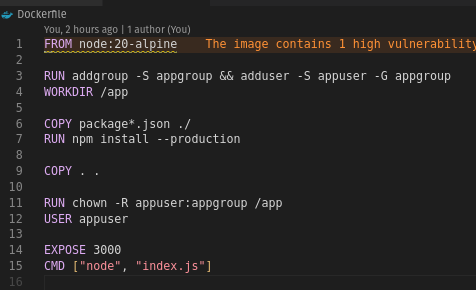
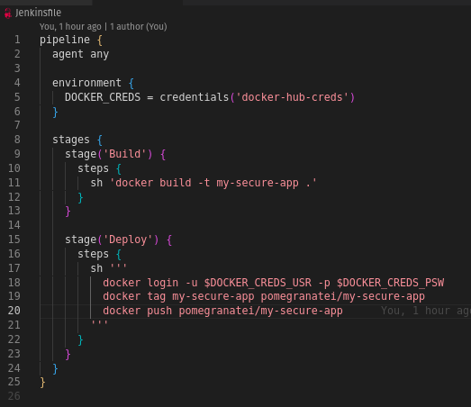
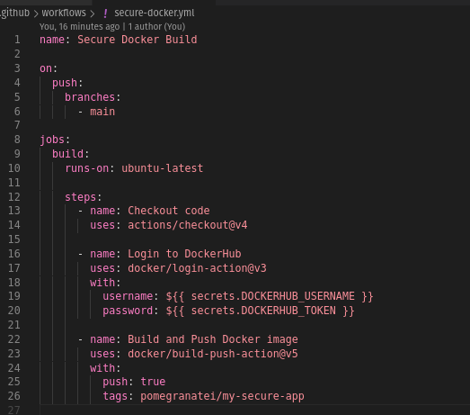
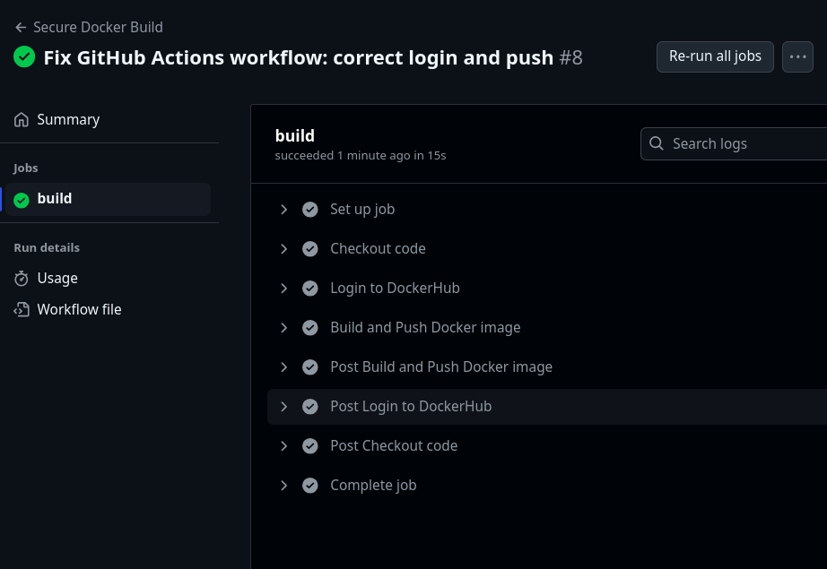

# Assignment 4: Secure CI/CD Pipeline with Docker and GitHub Actions

This project demonstrates a secure CI/CD deployment pipeline using **Docker**, **Jenkins**, and **GitHub Actions**, incorporating best practices like secret management and non-root Docker containers.

## 1. Docker Best Practices

### Implemented Security Measures:
- **Non-root User**: Dockerfile runs the app using a custom `appuser` to reduce privilege risks.
- **Secrets**: No secrets are hardcoded or included in image layers. `.env` is ignored via `.dockerignore`.

### Dockerfile

## 2. Jenkins Secure Pipeline

### Security Measures:
- Docker Hub credentials are stored securely in Jenkins as global credentials (`docker-hub-creds`).
- Secrets are referenced using the `credentials()` function in the Jenkinsfile.
- No hardcoded usernames or passwords.

## 3. GitHub Actions Secure Pipeline

### Security Measures:
- Docker Hub credentials stored as repository secrets (`DOCKERHUB_USERNAME`, `DOCKERHUB_TOKEN`).
- Secure login handled using `docker/login-action@v3`.
- Push operation handled by `docker/build-push-action@v5`.

## Challenges and Solutions

- Jenkins Docker login failed due to invalid or missing credentials
- **Solution**: Stored Docker Hub credentials securely as a Jenkins global credential using `docker-hub-creds` and referenced using `credentials()` block in `Jenkinsfile`.

- GitHub Actions failed with `access token has insufficient scopes`.
- **Solution**: Initially used a token with limited permission. Regenerated a Read/Write Docker Hub access token, tested it locally with `docker login`, and updated it in GitHub secrets.

- Docker image not found during push (`no such image`).
- **Solution**: Realized image name was incorrect or not built yet. Ensured the image was built and tagged before pushing.

- Build-push-action failed with `unexpected value 'secrets'`.
- **Solution**: Split authentication and build/push into two separate steps: first logging in with `docker/login-action`, then pushing via `docker/build-push-action`.

## Output

## Conclusion

This project successfully demonstrates secure Docker-based CI/CD deployment through:
- Dockerfile hardening (non-root user)
- Secret injection through Jenkins credentials and GitHub Actions secrets
- Proven push to Docker Hub from both Jenkins and GitHub

