# Docker Multi-Container Setup: Practical Report (Part 1)

## Objective
The aim of this exercise was to understand how to run and manage a multi-container application using Docker. Initially, containers were run individually using docker run, but later the process was simplified using Docker Compose.

## Key Concepts Learned
* Creating and using a Dockerfile inside application directories.
* Building Docker images with docker build.
* Running containers with docker run.
* Setting up a Docker bridge network using subnets for inter-container communication.
* Writing a docker-compose.yml file to manage services declaratively.

## Implementation Overview

1. Cloned the Sample Application

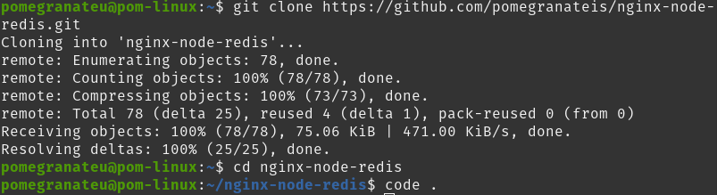

2. Built Docker Images
    * Created a Dockerfile in each application directory.
    * Built the images using docker build.
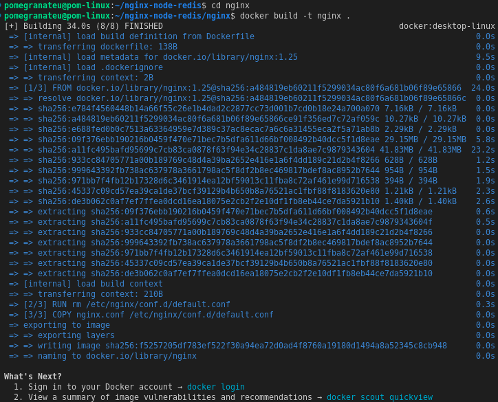
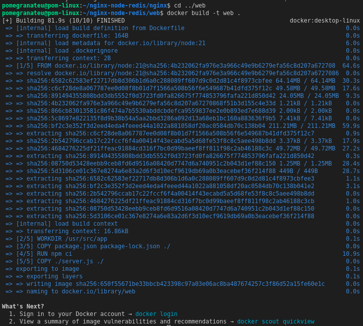

3. Created a Custom Network
To allow inter-container communication, a Docker bridge network with a subnet was created:


4. Ran Containers Individually
Each container was manually run and attached to the network.

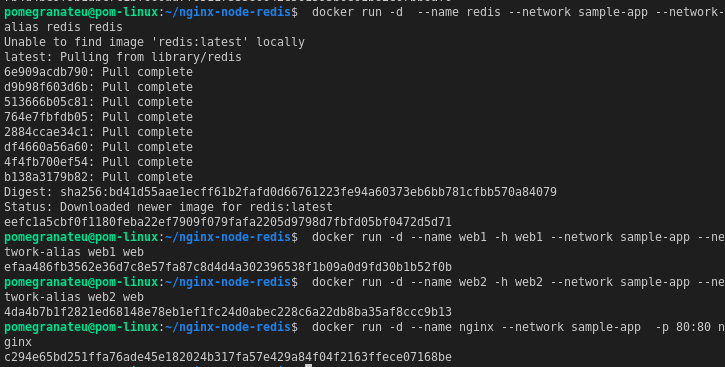

5. Verify the containers are up by running **docker ps**

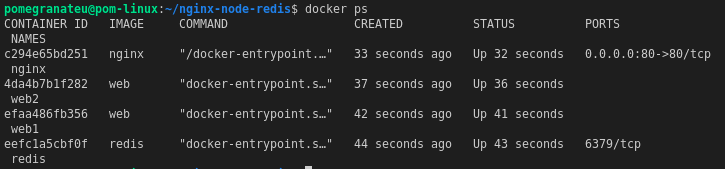

6. Tested the Application
The application was successfully accessed through:

```bash
http://localhost
```

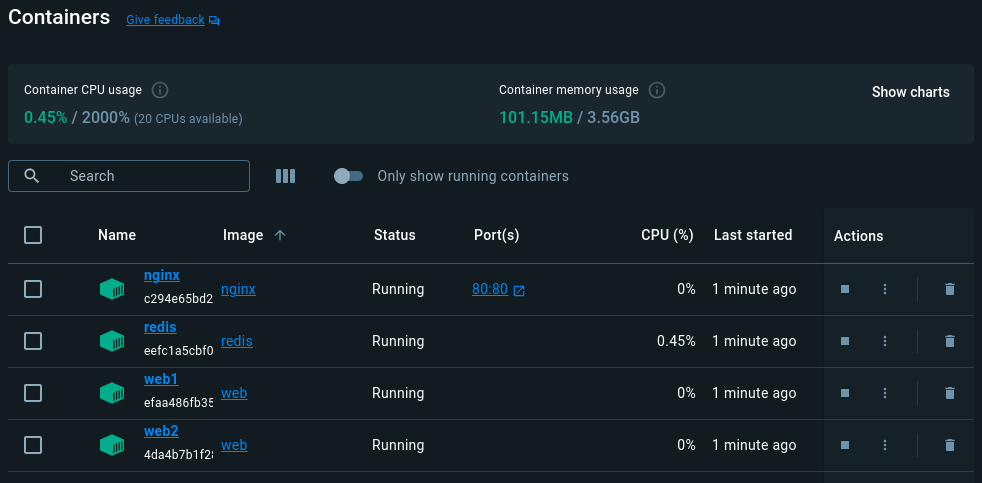
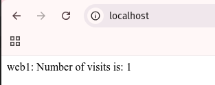


Refreshing the page showed load balancing behavior between **web1** and **web2**, with Redis maintaining a shared visit counter.

## Simplified with Docker Compose

Later, the whole process was replaced with a **docker-compose.yml** file which automated:

* Image building
* Container startup
* Network creation
* Port mapping

This started all services and connected them through a shared network, significantly reducing manual overhead.

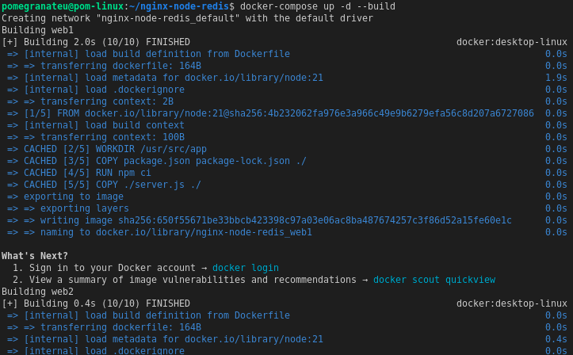
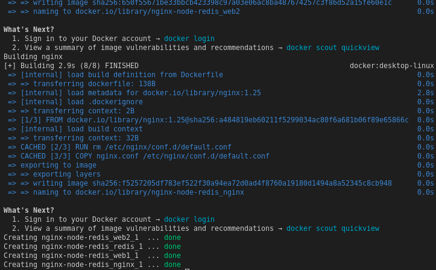

If you look at the Docker Desktop Dashboard, you can see the containers and dive deeper into their configuration.

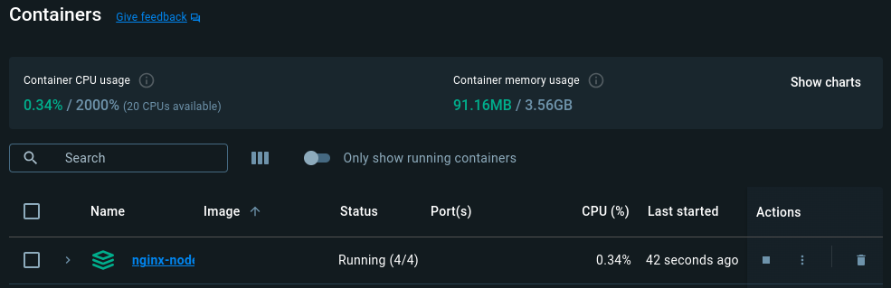

Alternatively, you can use the Docker Desktop Dashboard to remove the containers by selecting the application stack and selecting the Delete button.

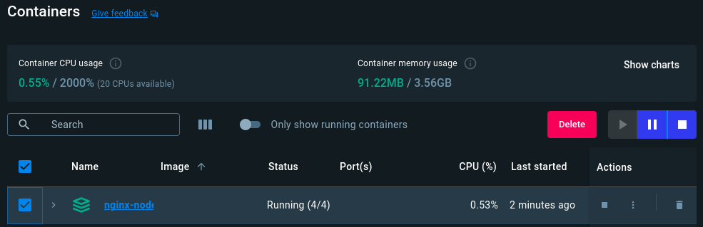

## Subnet Configuration

Special attention was given to:

Creating a custom Docker bridge network (sample-app) with a fixed subnet.

Verifying that containers received IPs within the subnet via:

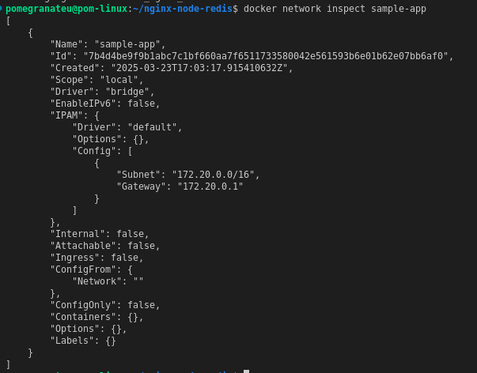

## Cleanup

To stop and clean up the application stack:

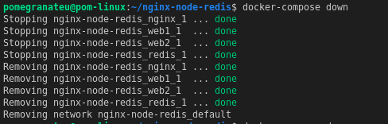

## Conclusion

* I gained confidence in building and running multi-container applications using Docker.

* Understood the importance of Docker networks and subnets for container communication.

* Learned how Docker Compose simplifies multi-service deployments.