# Practicals 4: Jenkins Server for a Git Repository

## Part A: Guided Exercise Report

### Objective

The objective of this practical was to set up a Jenkins server and configure a Continuous Integration (CI) pipeline for a Node.js application hosted in a Git repository. This involved plugin installation, tool configuration, job creation, and pipeline scripting using a Jenkinsfile.

### Tasks Performed

#### 1. Jenkins Setup and Access
- Deployed Jenkins using Docker.
- Accessed Jenkins via http://localhost:8080.

#### 2. Installed Required Plugins
- Due to plugin search limitations, used the manual plugin installation method:
- Uploaded each required plugin
- Restarted Jenkins to activate plugins.

#### 3. Configured Global Tools
Under NodeJS, added:
- Name: NodeJS-20.x
- Checked auto-installation of Node.js version 20.

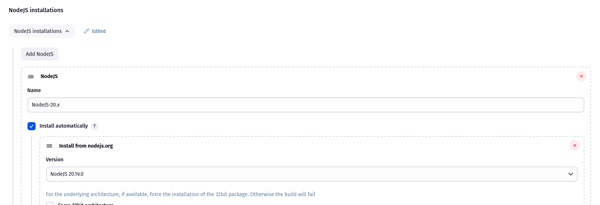

Git was available by default post plugin installation; no extra configuration needed.

#### 4. Created Pipeline Job

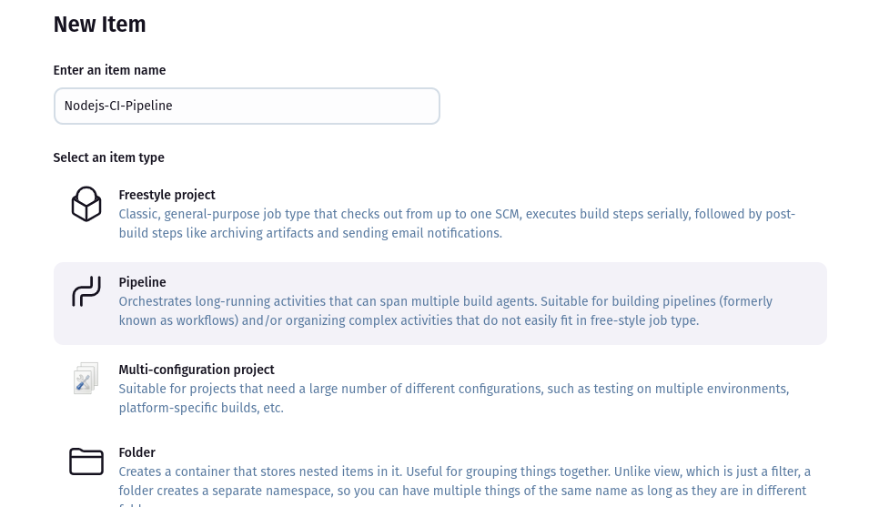
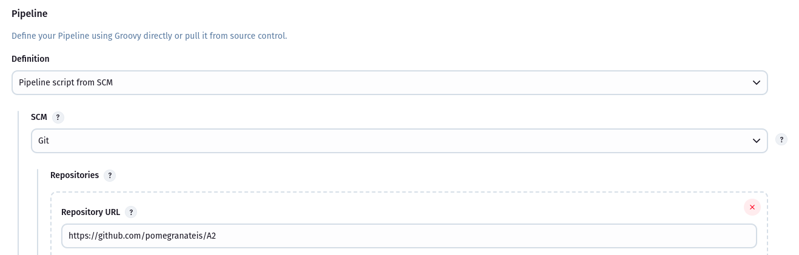
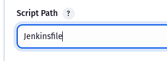

Under the Pipeline section:
- Selected: Pipeline script from SCM
- SCM: Git
- Entered Node.js project GitHub repo URL
- Script Path: Jenkinsfile

#### 5. Wrote the Jenkinsfile
Created a declarative pipeline with the following stages:

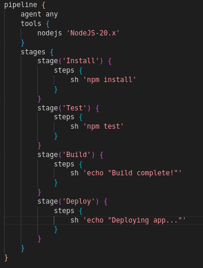

#### 6. Ran the Pipeline
Triggered the pipeline manually using the **Build Now** button.

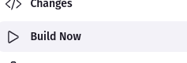
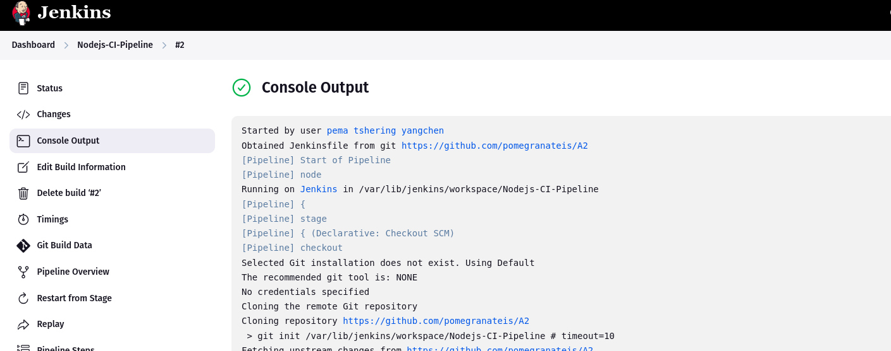
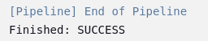

Jenkins cloned the repo, installed dependencies, ran tests, and built the project successfully.

### Challenges Faced

- Plugins such as Pipeline, Git, and NodeJS were not appearing in the available plugin list.
- Resolved by manually downloading .hpi files and uploading them via the Jenkins UI.
- Post-installation, required a Jenkins restart to activate plugin functionality.

## Part 2: Challenge Report

### Objective
The goal of Part 2 was to enhance the CI pipeline by introducing automated testing using a JavaScript testing framework (Jest or Mocha) and integrating JUnit-compatible test reporting into Jenkins.

### Tasks Performed
#### 1. Installed Required Tools

- Installed the following npm packages in the Node.js project:
    - jest: A popular JavaScript testing framework
    - jest-junit: A Jest reporter that outputs results in JUnit format

#### 2. Configured Testing in the Node.js Project

- Added a basic test case using Jest.

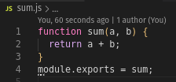
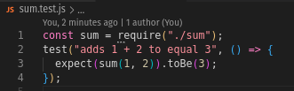

- Updated **package.json**

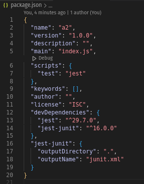

#### 3. Updated the Jenkinsfile

- Modified the Test stage in the Jenkinsfile to:
    - Run the test script with jest-junit reporter enabled
    - Capture the results with the junit command for Jenkins visualization
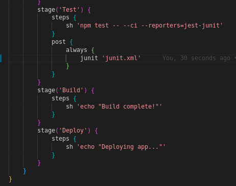

### Outcome

- Jenkins successfully executed Jest tests during the pipeline.
- A junit.xml file was generated and archived by Jenkins.
- Test results appeared in the Jenkins job interface under the "Test Result" section.

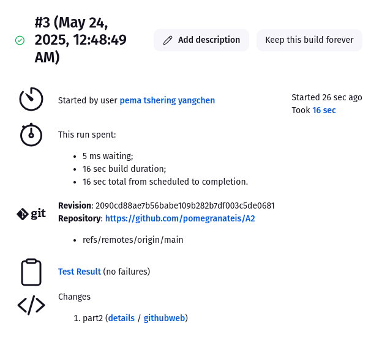

### Conclusion

This guided practical successfully demonstrated how to configure Jenkins for a Node.js project using a Git repository. Despite initial plugin availability issues, manual installation provided a reliable workaround. By the end of Part A, a complete CI pipeline was operational, laying the foundation for automation in real-world software development workflows.

This challenge demonstrated how to incorporate automated testing into a CI/CD pipeline using Jest and JUnit reporting. The integration allows developers to detect issues early and maintain code quality. Jenkins effectively visualized the test outcomes, supporting a more reliable build pipeline.

