# Practical 5 and 6 CI/CD Pipeline Report

## Objective
In this practical, I set up an end-to-end CI/CD pipeline using Jenkins for a simple Node.js application. The objective was divided into two parts:

- Part A: Create a basic Jenkins pipeline that pulls code from GitHub, installs dependencies, builds, tests, and deploys the app.

- Part B: Extend the pipeline to build a Docker image of the app and push it to Docker Hub using secured credentials.

## Tasks Completed

### Part A: Basic Jenkins Pipeline

I started by setting up a fresh GitHub repository and configured a Jenkins job as a pipeline project. I wrote a declarative Jenkinsfile with the following stages:

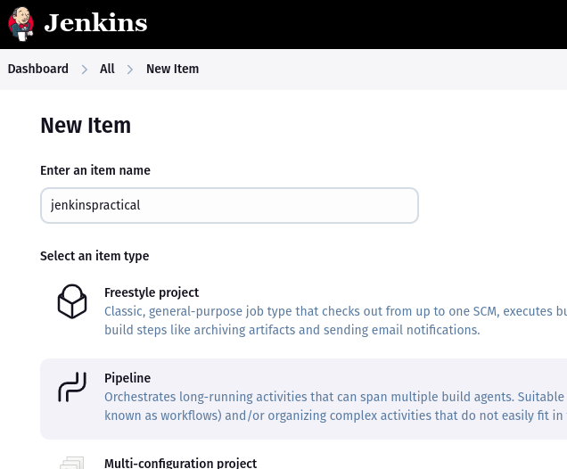
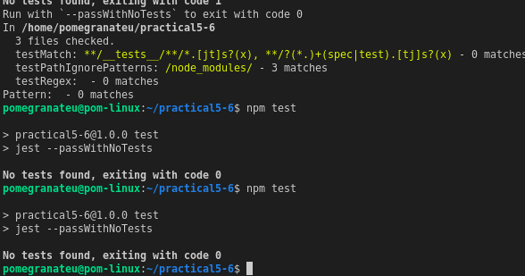

1. Install – Installed all project dependencies using npm install
2. Build – Ran a dummy build command to simulate a production build
3. Test – Executed a simple test script using jest --passWithNoTests
4. Deploy – Included conditional deployment logic based on the branch (main for production, others for staging)

All these steps ran successfully and completed with “Finished: SUCCESS” in Jenkins.

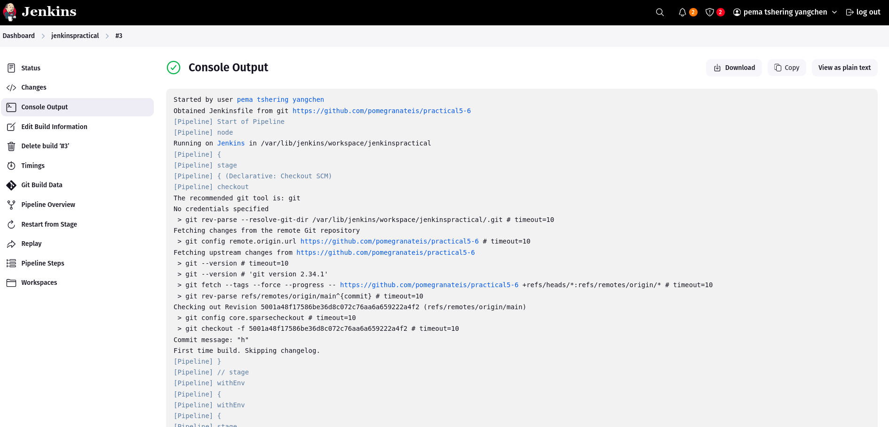
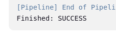

### Part B: Docker Integration
In the second part, I extended the pipeline by adding a new stage to build and push a Docker image:

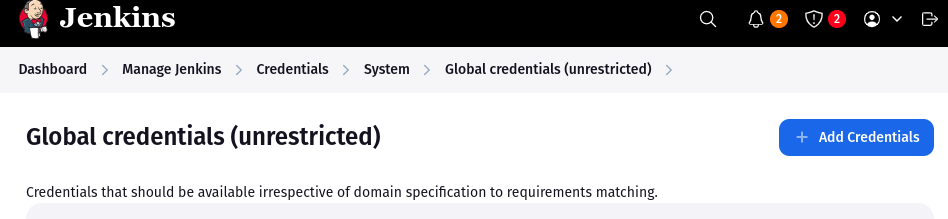
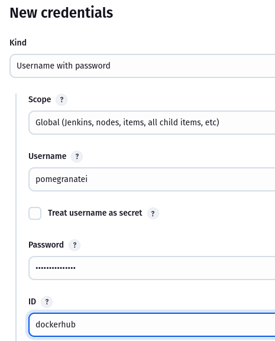

- I created a **Dockerfile** in the repo root to define the Node.js app image.
- In the **Jenkinsfile**, I added a stage that:
    - Used docker.build(...) to build the image
    - Used withCredentials(...) to log in to Docker Hub securely
    - Pushed the image to docker.io/pomegranatei/practical5-6

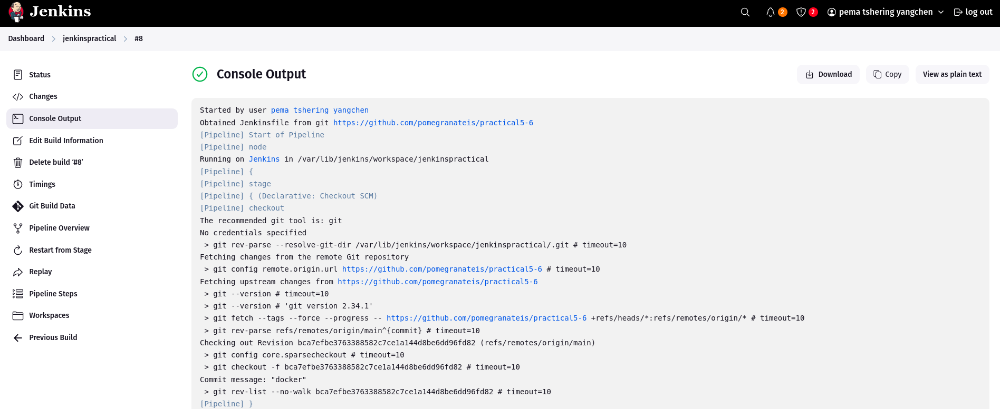
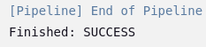

- I stored my Docker Hub username and access token securely in Jenkins' global credentials as **dockerhub**.

## Challenges Faced

Jenkins initially threw a Groovy script error because the Docker Pipeline plugin wasn’t installed. I fixed this by installing the plugin and restarting Jenkins.

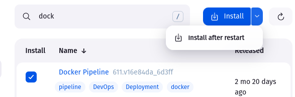
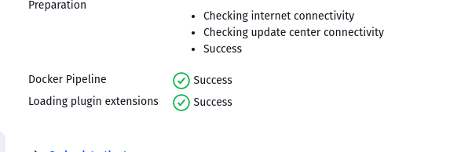

I encountered Docker permission errors (/var/run/docker.sock) which I resolved by adding the Jenkins user to the docker group.

At one point, I faced a network timeout when logging in to Docker Hub. It was resolved after verifying the Jenkins host had proper internet access.

## Final Outcome

Both parts of the pipeline are now fully functional. When I run the Jenkins job:
- It pulls the latest code from GitHub
- Installs, builds, and tests the app
- Deploys based on branch
- Builds a Docker image and pushes it to my Docker Hub repository

I can confirm that the image pomegranatei/practical5-6:latest now exists and updates with each build.

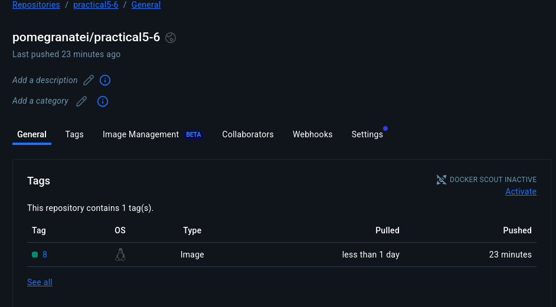

## Conclusion

This practical gave me a complete hands-on understanding of how CI/CD pipelines are created and extended using Jenkins. 

I also gained valuable experience working with Docker integration, credentials management, and troubleshooting real-world pipeline failures. I now feel more confident building automated workflows for any future Node.js projects.

