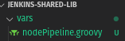
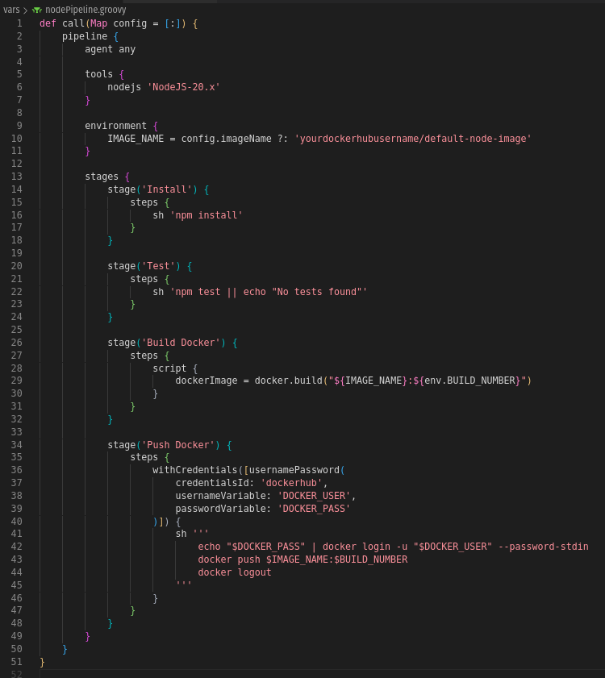
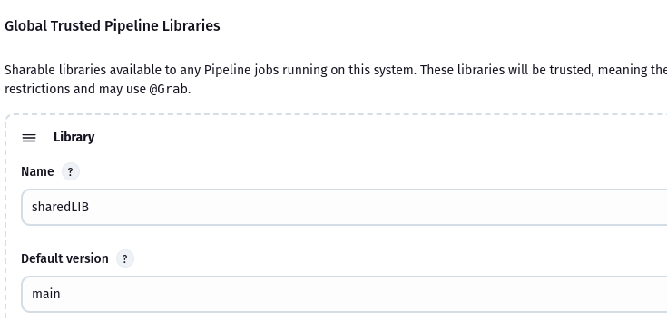
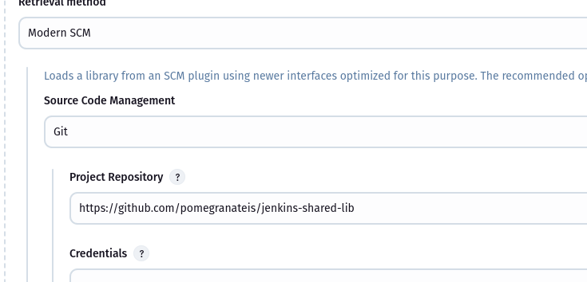
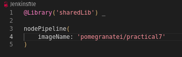
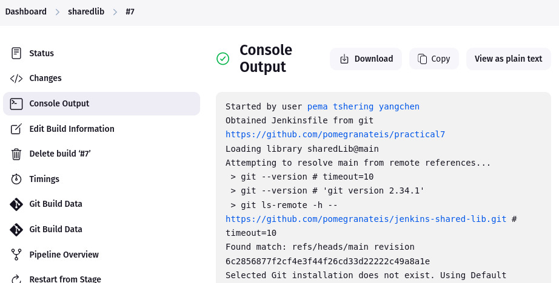

# Practical 7 Report: Creating Shared Library in Jenkins

## Objective
The goal of this practical was to create a reusable Jenkins Shared Library that can be used across multiple Node.js projects. The shared library needed to include common CI/CD steps like installing dependencies, running tests, building a Docker image, and pushing it to Docker Hub.

## Steps Taken

- Created a new GitHub repository named jenkins-shared-lib to host the shared library. Inside the repo, I created the required structure:

- In nodePipeline.groovy, I wrote a reusable call() method that encapsulates:
    - npm install
    - npm test
    - Docker build
    - Docker push (using withCredentials)

- Then, I went to **Configure System** and registered the shared library under Global Pipeline Libraries with the name sharedLib.

- Then, I simplified the Jenkinsfile to:

- Before triggering the Jenkins pipeline, we can verify your Docker image locally. After that, we connect the Jenkins pipeline to the shared library by adding the library name in the Jenkinsfile.

- I pushed the changes and ran the pipeline and it successfully pulled the shared library and executed all stages.

## Challenges Faced

- debuging a small issue with Groovy syntax in the call() function, especially when passing map parameters (imageName).

## Final Outcome

The shared library worked as intended. I was able to trigger a Jenkins pipeline from my Node.js project that used the centralized nodePipeline() logic. This significantly reduced code duplication and improved consistency across projects.

Now, any future Node.js CI/CD workflows I build can reuse this shared logic just by importing the shared library.

