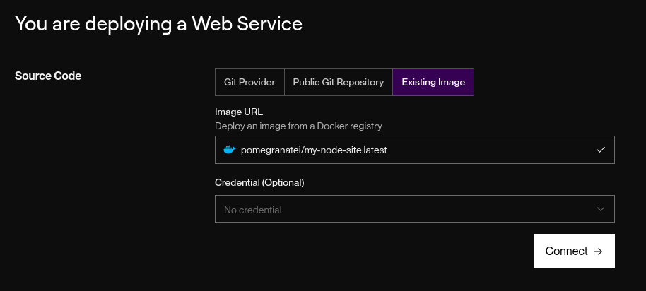

# Practical 8 CI/CD Deployment Report

***Implementing a Complete CI/CD Workflow Using GitHub Actions and Deploy Your Application***

## Objective

The goal of this practical was to implement a CI/CD pipeline that:
- Builds and pushes a Docker image to Docker Hub using GitHub Actions
- Deploys the Docker image to Render
- Automates the process using Git-based triggers

## Steps Taken

1. Created Node.js Static App
- Set up a basic Express server (index.js) serving a message on port 3000.
- Added a Dockerfile to containerize the app.

2. Configured GitHub Actions
- Created .github/workflows/deploy.yml
- Pipeline triggers on push to main
- Steps included:
    - Checkout code
    - Login to Docker Hub
    - Build Docker image
    - Push image to Docker Hub

3. Set GitHub Secrets

- GitHub Secrets for authentication.

4. Pushed to GitHub
- Initialized Git repo and pushed to GitHub

- GitHub Actions workflow ran successfully and pushed image to Docker Hub as:

5. Deployed on Render
- Selected "Deploy Web Service" from an Existing Image
- Entered the Docker Hub image URL
- Exposed port **3000**
- Left default CMD as node index.js

## Outcome
- CI/CD pipeline is working as intended.

Code push; triggers Docker build image pushed;Render deploys.

The live service is accessible and reflects the latest code.

## Conclusion

This practical demonstrates the full DevOps lifecycle from source code to production using modern cloud tools. It strengthened my understanding of:
- Docker image creation
- GitHub CI/CD pipelines
- Public/private image handling
- Real-world cloud deployment workflows

