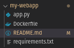
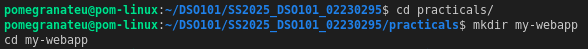
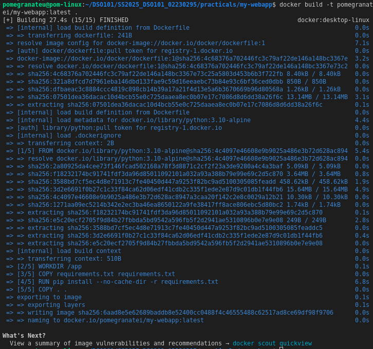
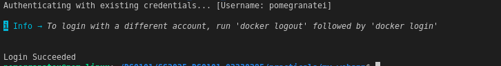
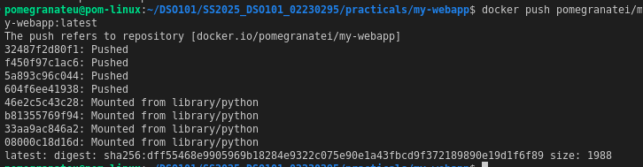
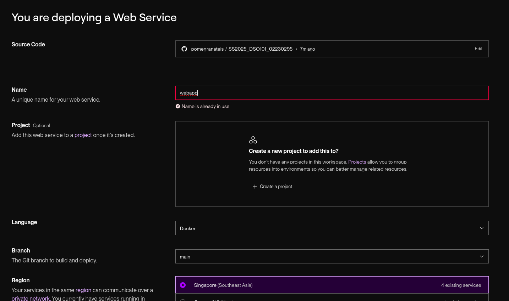
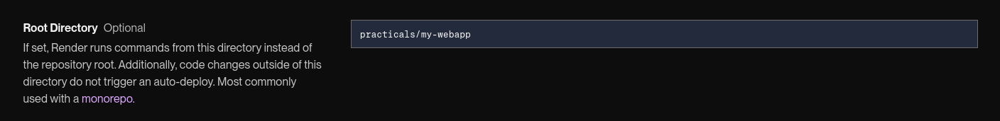
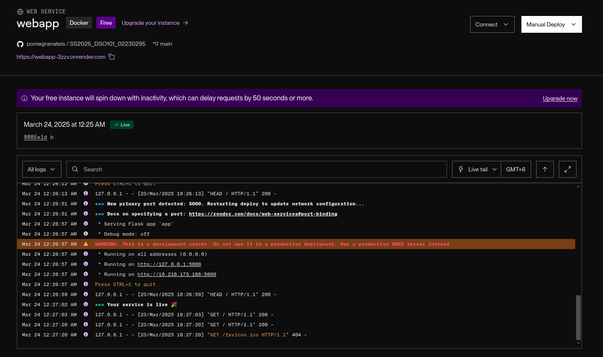
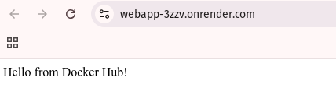

# Docker Image Build and Deployment Report

***Render link***

https://webapp-3zzv.onrender.com/

## Overview
This report summarizes the process of building a Docker image locally and deploying it to Render from a subfolder within a larger repository.

---

### 1. Building the Docker Image Locally

1. **Navigate to the Project Folder**  
   Since our Dockerfile and application code reside in `my-webapp`:
   ```bash
   cd SS2025_DSO101_02230295/practicals/my-webapp

2. Build an **app.py** file

```python
from flask import Flask

app = Flask(__name__)

@app.route('/')
def hello():
    return 'Hello from Docker Hub!\n'

if __name__ == '__main__':
    app.run(host='0.0.0.0', port=5000)
```

3. Create a **requirements.txt** File

```bash
flask
```

4. Create a **Dockerfile**

```Dockerfile
# syntax=docker/dockerfile:1
FROM python:3.10-alpine
WORKDIR /app
COPY requirements.txt requirements.txt
RUN pip install --no-cache-dir -r requirements.txt
COPY . .
EXPOSE 5000
CMD ["python", "app.py"]
```

5. Review the Project Structure

Ensure the Dockerfile is present:



6. Build the Docker Image

- Create a folder and navigate to it


- Build the Docker image.

```bash
docker build -t your-dockerhub-username/my-webapp:latest.
```



* **-t username/my-webapp:latest** names (tags) the image.

* **.** specifies the current directory as the build context.

### 2. Pushing the Image to Docker Hub

1. Log in to Docker Hub



2. Push the Image



### 3. Deploying the Image to Render


#### 1. Connect to GitHub

* On Render, create a new Web Service.

* Select **Docker** as the environment.

* Choose the main (or relevant) branch of your GitHub repository.



#### 2. Specify the Root Directory

* If the **my-webapp** folder is nested under **SS2025_DSO101_02230295/practicals/**, set *Root Directory* to **practicals/my-webapp**.

* This tells Render to look for the Dockerfile in my-webapp and build from that folder.



#### 3. Configure Deployment Settings

* **Region**: Pick the region closest to your users (e.g., Oregon or Singapore).

* **Dockerfile**: Render automatically detects *Dockerfile* in the root directory you specified.

* **Start Command**: If needed, specify how to run your container. Otherwise, Render infers it from your Dockerfile (*CMD*).

#### 4. Verify

* Once deployment is successful, Render provides a URL.

* Visit that URL to confirm your application is running.





## Conclusion

By following these steps, we successfully:
* Built a Docker image from our local **my-webapp** folder.

* Pushed the image to Docker Hub for easy sharing and versioning.

* Deployed the application to Render by configuring the subfolder as the *Root Directory* and using the Docker environment.

This workflow ensures our containerized application can be developed locally, stored on Docker Hub, and automatically built and deployed on Render with each commit to our GitHub repository.