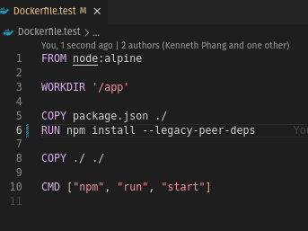

# Practical Report: Deploying a React Application with Docker and Nginx

## Overview

This practical demonstrates how to containerize a React application using Docker with a multi-stage build. The process includes building the app with Node.js and serving the optimized static files with Nginx.

## Prerequisites

- **Docker** installed on your system.
- A **React application** (e.g., created with Create React App).
- Basic familiarity with Docker commands and multi-stage builds.

## Steps and Implementation

### 1. Clone the repository and **checkout** to the development branch

Before proceeding any further to create the Docker configuration

Install the application’s libraries via npm install/ yarn install

Run the application to make sure it is working as expected locally

**YOU SHOULD BE FACING ISSUES -> NODE VERSION ISSUES

Hint: you might need to drop your node version to 16 or below**

### 2. Create a Dockerfile.test
Create a Dockerfile.test under the React App (subsdevices) on the root working directory

### 3. Build the Docker Image

### 4. Run the Docker Image as Container

- Use port forward and volume mounting, once it is up and running

**OR** run from Docker GUI

*You might face this issue when running the built image

**Choosing an exact node version** -> 16

- After defining the version. Rebuild your image

**In order to exit the container , issue the subcommand ps to look for the container id and stop it**

### 5. Create a docker-compose.yml file

**Start the docker container using docker compose.**

To verify that the app is running. Open your web browser -> http://localhost:3000.

Execute the following command. Implement test on separate container, please replace the placeholder value of the container id on the exec command.

In order to exit the shell out back to the host OS, type exit on the container shell

**Add test service in the docker compose yml file, save the yml**

**Stop the container by using the below command**

### 6. Create a Dockerfile for Multi-Stage Build

Let's continue building a multi step build process, different base images, **create a NEW Dockerfile with the name Dockerfile** and copy paste the below to the Dockerfile

**Rebuild and Start the docker container using docker compose, in order to incorporate the test service.**

Check whether the container is up and running by issuing the below command
**(there should be 2 containers running)**

**Once both the services is running stop the container**

**Build the multi phase container setup, DO NOT terminate this process. Wait till the following show up Successfully built image id**

* Move Dockerfile.test out of the root directory.
* Might need to upper case the "as" to "AS" in the Dockerfile

* Take note of the the image id.

**Build the multi phase container setup, DO NOT terminate this process. Wait till the following show up Successfully built image id OR CHECK DOCKER DESKTOP GUI**

Start the multi phase container setup and expose the port, please replace the hash value of the container id.

Check whether the container is up and running by issueing the below command

Launch your browser and try accessing the app at localhost:80

## Conclusion

This practical demonstrated:

* How to address Node.js dependency and OpenSSL issues using --legacy-peer-deps and NODE_OPTIONS=--openssl-legacy-provider.

* The creation of a multi-stage Dockerfile to efficiently build and deploy a React application.

* The process of cleaning up the Docker environment, building the image, and running the container with Nginx serving the static files.

This report encapsulates the troubleshooting journey from encountering Node.js issues to achieving a successful Dockerized deployment of the React application.
